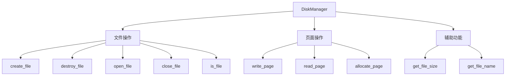
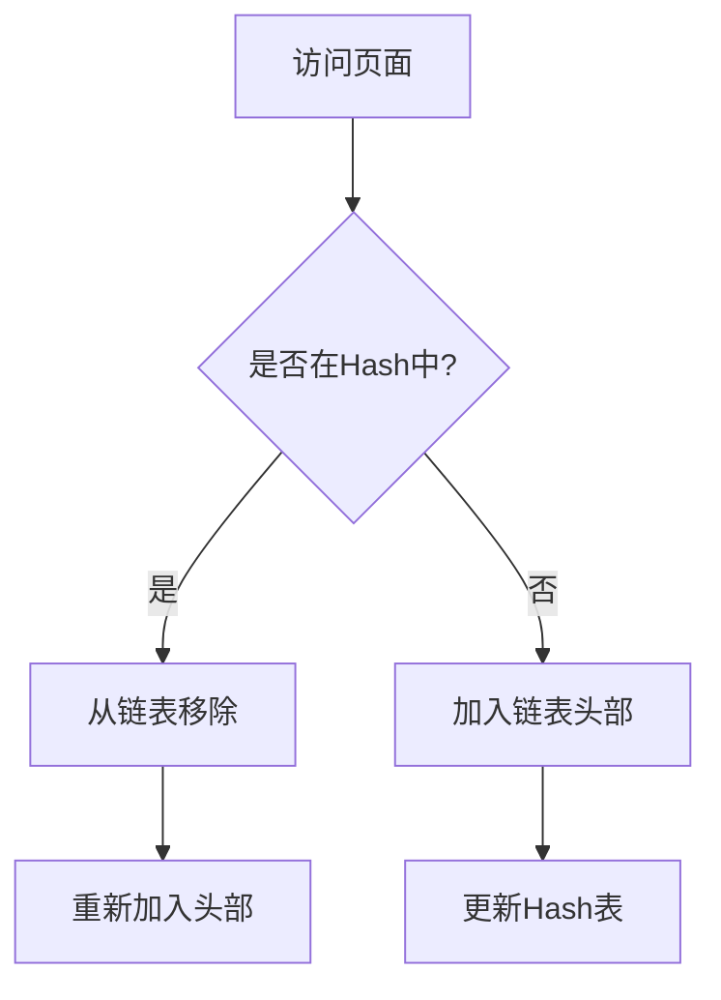
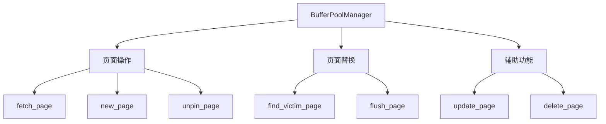

# RUCbase Lab1 存储管理实验技术文档

## 1. 磁盘管理器(DiskManager)

### 1.1 模块架构


### 1.2 完整函数实现

#### 1.2.1 文件操作函数
```cpp
// 创建文件
void DiskManager::create_file(const std::string &path) {
    if (is_file(path)) throw FileExistsError(path);
    int fd = open(path.c_str(), O_CREAT, 0600);
    if (fd == -1) throw UnixError();
    close(fd);
}

// 打开文件
int DiskManager::open_file(const std::string &path) {
    if (!is_file(path)) throw FileNotFoundError(path);
    if (path2fd_.count(path)) return path2fd_[path];
    
    int fd = open(path.c_str(), O_RDWR);
    if (fd == -1) throw UnixError();
    
    fd2path_[fd] = path;
    path2fd_[path] = fd;
    return fd;
}

// 关闭文件
void DiskManager::close_file(int fd) {
    if (!fd2path_.count(fd)) throw FileNotOpenError(fd);
    std::string path = fd2path_[fd];
    fd2path_.erase(fd);
    path2fd_.erase(path);
    close(fd);
}
```

#### 1.2.2 页面操作函数
```cpp
// 读取页面
void DiskManager::read_page(int fd, page_id_t page_no, char *offset, int num_bytes) {
    off_t offset_in_file = page_no * PAGE_SIZE;
    if (lseek(fd, offset_in_file, SEEK_SET) == -1) throw UnixError();
    
    ssize_t bytes_read = read(fd, offset, num_bytes);
    if (bytes_read != num_bytes) {
        throw InternalError("DiskManager::read_page Error");
    }
}

// 分配页面
page_id_t DiskManager::allocate_page(int fd) {
    assert(fd >= 0 && fd < MAX_FD);
    return fd2pageno_[fd]++; // 原子操作保证线程安全
}
```

#### 1.2.3 辅助函数
```cpp
// 获取文件大小
int DiskManager::get_file_size(const std::string &file_name) {
    struct stat stat_buf;
    int rc = stat(file_name.c_str(), &stat_buf);
    return rc == 0 ? stat_buf.st_size : -1;
}

// 获取文件名
std::string DiskManager::get_file_name(int fd) {
    if (!fd2path_.count(fd)) throw FileNotOpenError(fd);
    return fd2path_[fd];
}
```

## 2. LRU替换策略(LRUReplacer)

### 2.1 算法实现


### 2.2 完整函数实现

#### 2.2.1 核心函数
```cpp
// 选择淘汰页面
bool LRUReplacer::victim(frame_id_t* frame_id) {
    std::scoped_lock lock{latch_};  // 自动加锁解锁
    if(LRUlist_.empty()) return false;  // 无页面可淘汰
    
    *frame_id = LRUlist_.back();  // 获取最近最少使用的页面
    LRUlist_.pop_back();          // 从链表移除
    LRUhash_.erase(*frame_id);    // 从哈希表移除
    return true;
}

// 固定页面(不可被淘汰)
void LRUReplacer::pin(frame_id_t frame_id) {
    std::scoped_lock lock{latch_};
    auto it = LRUhash_.find(frame_id);
    if (it != LRUhash_.end()) {   // 如果存在于替换器
        LRUlist_.erase(it->second); // 从链表移除
        LRUhash_.erase(it);       // 从哈希表移除
    }
}

// 取消固定页面(可被淘汰) 
void LRUReplacer::unpin(frame_id_t frame_id) {
    std::scoped_lock lock{latch_};
    if (LRUhash_.find(frame_id) == LRUhash_.end()) {  // 如果不在替换器
        LRUlist_.push_front(frame_id);     // 加入链表头部
        LRUhash_[frame_id] = LRUlist_.begin(); // 更新哈希表
    }
}
```

### 2.3 数据结构说明
```cpp
private:
    std::mutex latch_;               // 互斥锁
    std::list<frame_id_t> LRUlist_;  // 双向链表(LRU顺序)
    std::unordered_map<frame_id_t, 
        std::list<frame_id_t>::iterator> LRUhash_;  // 哈希表加速查找
    size_t max_size_;                // 最大容量
```

## 3. 缓冲池管理器(BufferPoolManager)

### 3.1 模块架构


### 3.2 完整函数实现

#### 3.2.1 核心操作函数
```cpp
// 获取页面
Page* BufferPoolManager::fetch_page(PageId page_id) {
    std::scoped_lock lock{latch_};
    
    // 1. 检查页表
    if(page_table_.count(page_id)) {
        frame_id_t frame_id = page_table_[page_id];
        replacer_->pin(frame_id);  // 固定页面
        pages_[frame_id].pin_count_++;
        return &pages_[frame_id];
    }
    
    // 2. 寻找可替换帧
    frame_id_t frame_id;
    if(!find_victim_page(&frame_id)) return nullptr;
    
    // 3. 处理脏页
    Page* page = &pages_[frame_id];
    if(page->is_dirty()) {
        disk_manager_->write_page(page->get_page_id().fd, 
                                page->get_page_id().page_no,
                                page->get_data(),
                                PAGE_SIZE);
    }
    
    // 4. 读取新页面
    disk_manager_->read_page(page_id.fd, page_id.page_no, 
                           page->get_data(), PAGE_SIZE);
    
    // 5. 更新元数据
    update_page(page, page_id, frame_id);
    replacer_->pin(frame_id);
    page->pin_count_ = 1;
    
    return page;
}

// 新建页面
Page* BufferPoolManager::new_page(PageId* page_id) {
    std::scoped_lock lock{latch_};
    
    // 1. 寻找可用帧
    frame_id_t frame_id;
    if(!find_victim_page(&frame_id)) return nullptr;
    
    // 2. 分配页面编号
    page_id->page_no = disk_manager_->allocate_page(page_id->fd);
    
    // 3. 更新页面数据
    Page* page = &pages_[frame_id];
    update_page(page, *page_id, frame_id);
    
    // 4. 固定页面
    replacer_->pin(frame_id);
    page->pin_count_ = 1;
    
    return page;
}
```

#### 3.2.2 辅助函数
```cpp
// 寻找可替换帧
bool BufferPoolManager::find_victim_page(frame_id_t* frame_id) {
    if(!free_list_.empty()) {  // 优先使用空闲帧
        *frame_id = free_list_.front();
        free_list_.pop_front();
        return true;
    }
    return replacer_->victim(frame_id);  // 使用LRU策略淘汰
}

// 更新页面数据
void BufferPoolManager::update_page(Page* page, PageId new_page_id, frame_id_t new_frame_id) {
    // 写回脏页
    if(page->is_dirty()) {
        disk_manager_->write_page(page->get_page_id().fd,
                                page->get_page_id().page_no,
                                page->get_data(),
                                PAGE_SIZE);
    }
    
    // 更新页表
    page_table_.erase(page->id_);
    if(new_page_id.page_no != INVALID_PAGE_ID) {
        page_table_[new_page_id] = new_frame_id;
    }
    
    // 重置页面
    page->reset_memory();
    page->id_ = new_page_id;
    page->is_dirty_ = false;
    page->pin_count_ = 0;
}
```

### 3.3 关键数据结构
```cpp
private:
    size_t pool_size_;                  // 缓冲池大小
    DiskManager* disk_manager_;         // 磁盘管理器
    std::deque<frame_id_t> free_list_;  // 空闲帧列表
    std::unordered_map<PageId, frame_id_t> page_table_;  // 页表
    Page* pages_;                       // 页面数组
    Replacer* replacer_;                // 页面替换器
    std::mutex latch_;                  // 互斥锁
```

## 4. 测试方案
| 测试项 | 测试方法 | 预期结果 |
|-------|---------|---------|
| 页面读写 | 写入后立即读取 | 数据一致 |
| LRU策略 | 顺序访问测试页 | 淘汰顺序正确 | 
| 并发访问 | 多线程读写测试 | 数据一致无冲突 |

## 5. 扩展思考
1. 如何改进页面分配策略？
2. 其他替换算法对比(LFU,Clock等)
3. 大页内存优化可能性
